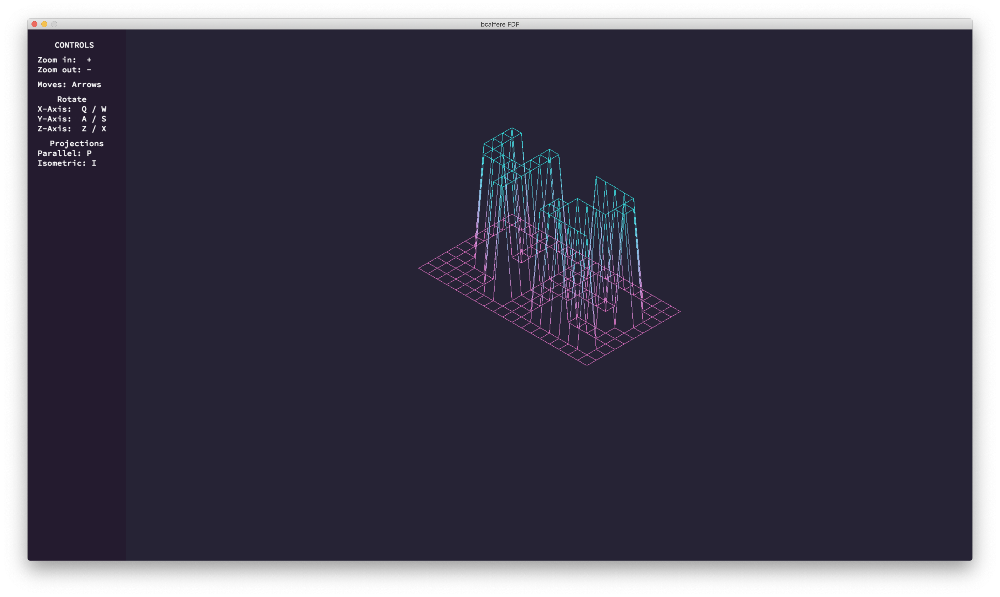
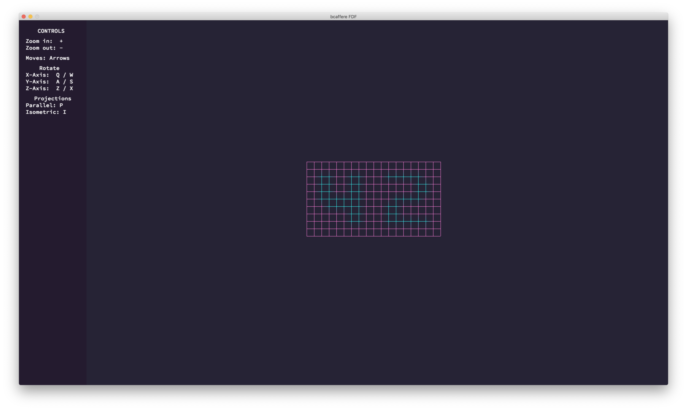
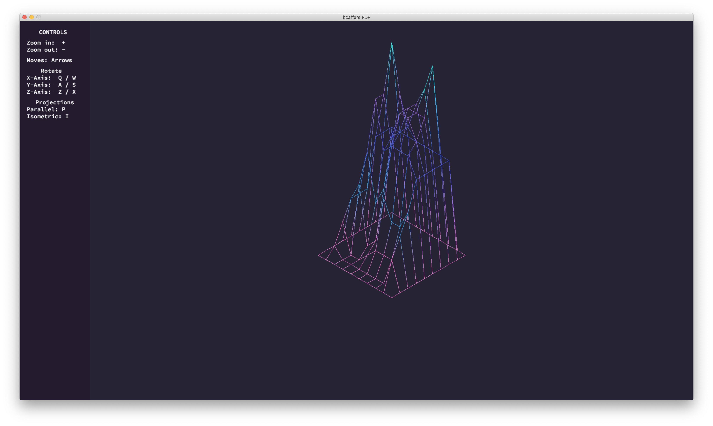
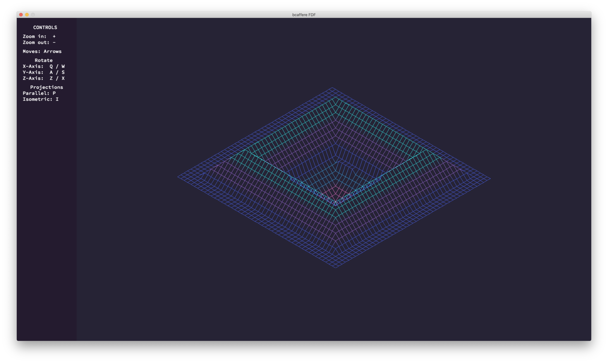
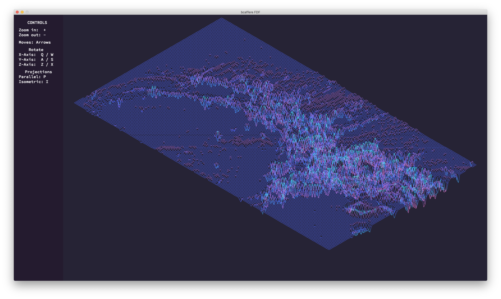
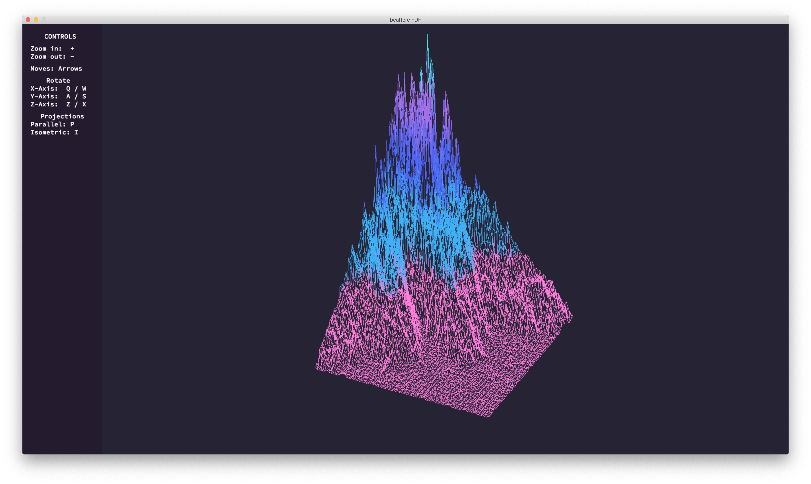

 
# `fdf`
The purpose of this project is to create a simplified graphic 3D Wireframe Viewer.
__(macOS is only supported)__ 
You can read task: [`fdf.subject.pdf`](subject/fdf.subject.pdf)

### Discription of mandatory part
For this project, we need use graphic library: `miniLibX`.
More info about you can read [here](https://harm-smits.github.io/42docs/libs/minilibx/getting_started.html)

To begin `fdf` has to show the map using isometric projection.
How draw a lines, only your choice. I use [Bresenham's line algorithm](https://en.wikipedia.org/wiki/Bresenham%27s_line_algorithm), but for more beautiful result i recomend use [Xiaolin Wu's line algorithm](https://en.wikipedia.org/wiki/Xiaolin_Wu%27s_line_algorithm).
Needed handle the events pressing the red button and pressing ESC button to close window.
### Discription of bonus part
In bonus part you need realised all axis rotating, axis move, zoom and extra projection.
##### X Axis rotating

##### Y Axis rotating

##### Z Axis rotating

##### Parallel projection

#### Own additions
To creat this project more gracefull, i add left menu with controls and make colors gradient.
Colour theme copied from [SynthWave '84(VS code theme)](https://marketplace.visualstudio.com/items?itemName=RobbOwen.synthwave-vscode)
##### Others maps

### Evaluated by moulinette

