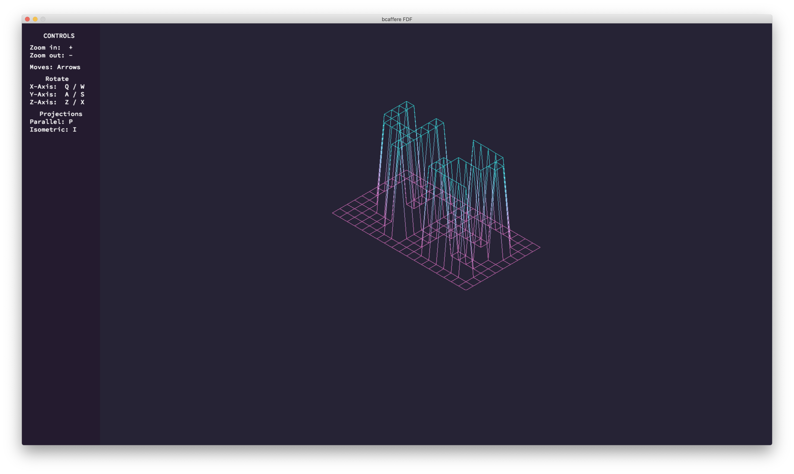
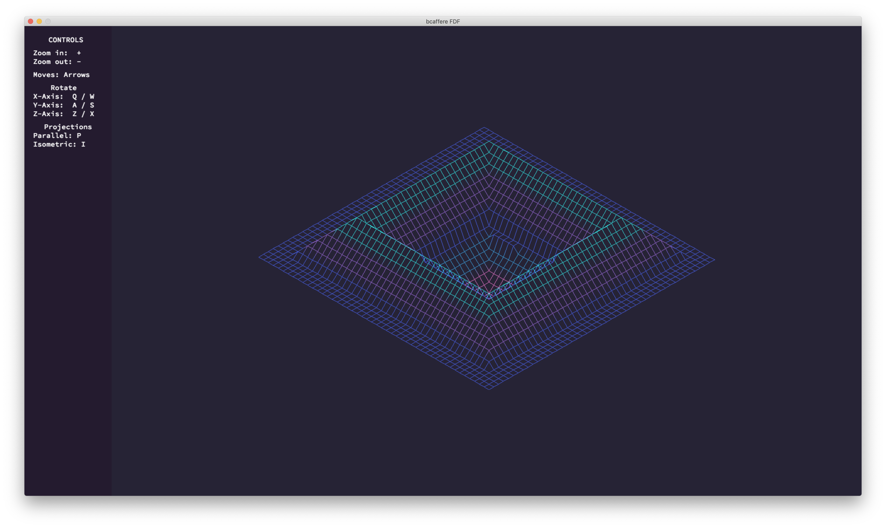

 
# `fdf`
Целью данного проекта является создание упрощенного графического 3D Wireframe Viewer.
__(поддерживается только на macOS)__ 
Задание можно прочитать здесь: [`fdf.subject.pdf`](subject/fdf.subject.pdf)

### Описание основной части
Для этого проекта нам необходимо использовать графическую библиотеку: `miniLibX`.
Более подробную информацию о ней вы можете прочитать [здесь](https://harm-smits.github.io/42docs/libs/minilibx/getting_started.html)

Для начала `fdf` должен показать карту, используя изометрическую проекцию.
Каким способом рисовать линии, выбирать только вам. Я использую [Алгоритм Брезенхэма](https://ru.wikipedia.org/wiki/%D0%90%D0%BB%D0%B3%D0%BE%D1%80%D0%B8%D1%82%D0%BC_%D0%91%D1%80%D0%B5%D0%B7%D0%B5%D0%BD%D1%85%D1%8D%D0%BC%D0%B0), но для более красивого результата я рекомендую использовать [Алгоритм Ву](https://ru.wikipedia.org/wiki/%D0%90%D0%BB%D0%B3%D0%BE%D1%80%D0%B8%D1%82%D0%BC_%D0%92%D1%83).
Необходимо обрабатывать события нажатия красной кнопки и нажатия кнопки ESC для закрытия окна.
### Описание бонусной части
В бонусной части необходимо реализовать вращения по осям, перемещение по осям, маштабирование и дополнительную проекцию.
##### Вращение по оси Х

##### Вращение по оси Y

##### Вращение по оси Z

##### Параллельная проекция

#### Собственные дополнения
Чтобы сделать этот проект более изящным, я добавил левое меню с элементами управления и сделал цвета градиентными.
Цветовая тема скопирована с [SynthWave '84(VS code theme)](https://marketplace.visualstudio.com/items?itemName=RobbOwen.synthwave-vscode)
##### Другие карты

### Оценка от moulinette

